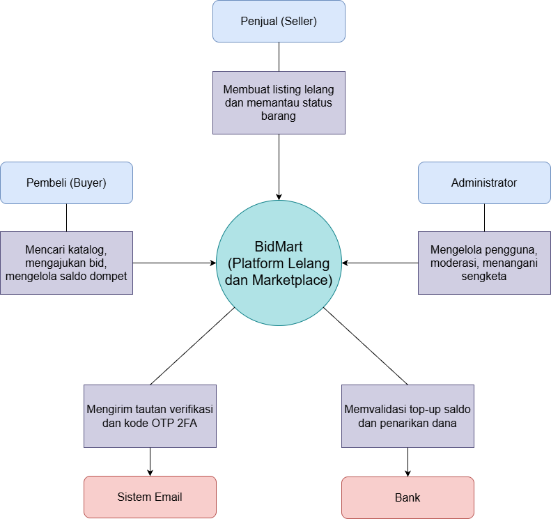
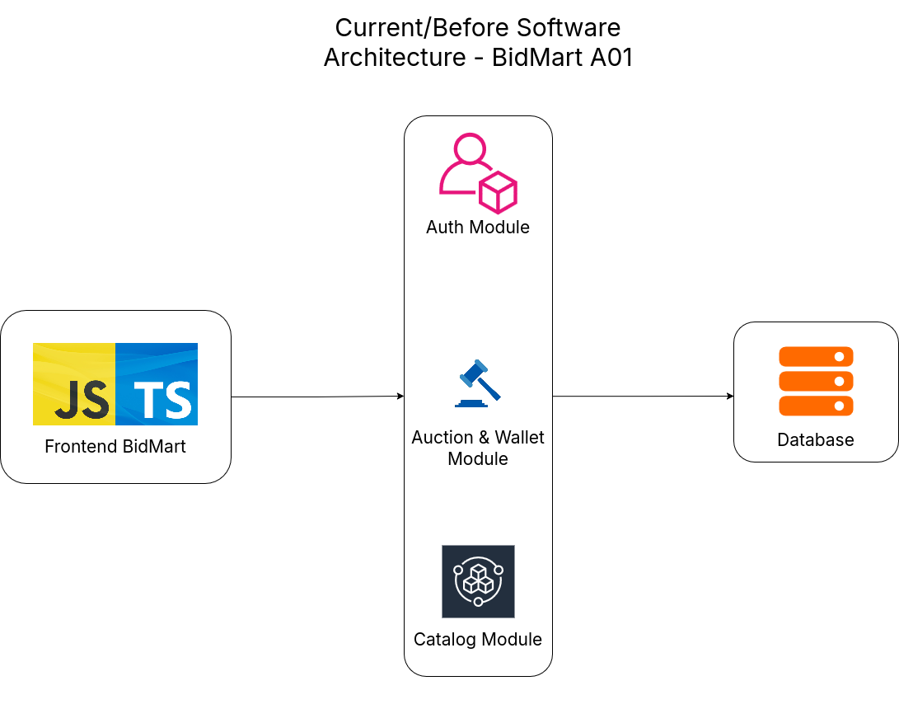
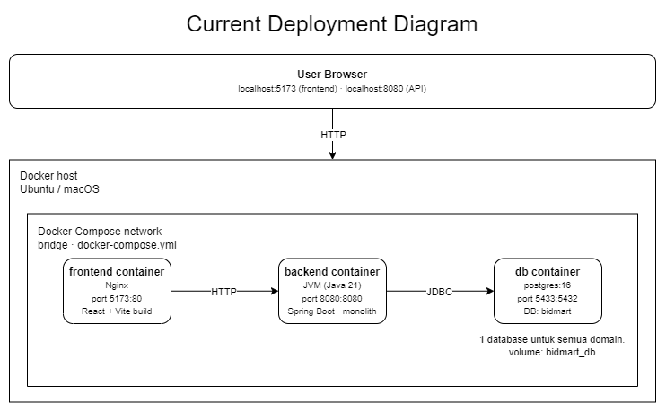
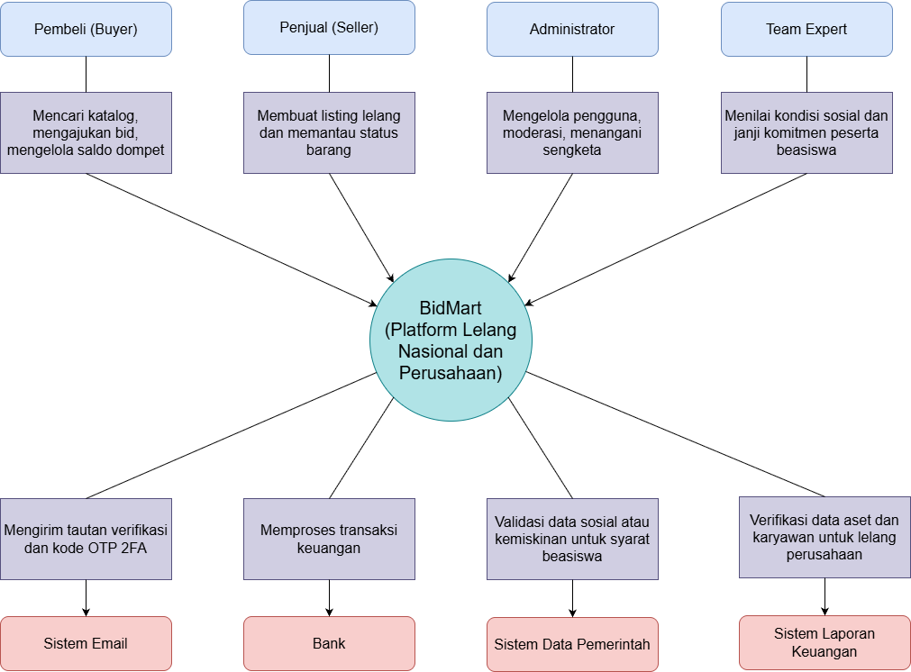
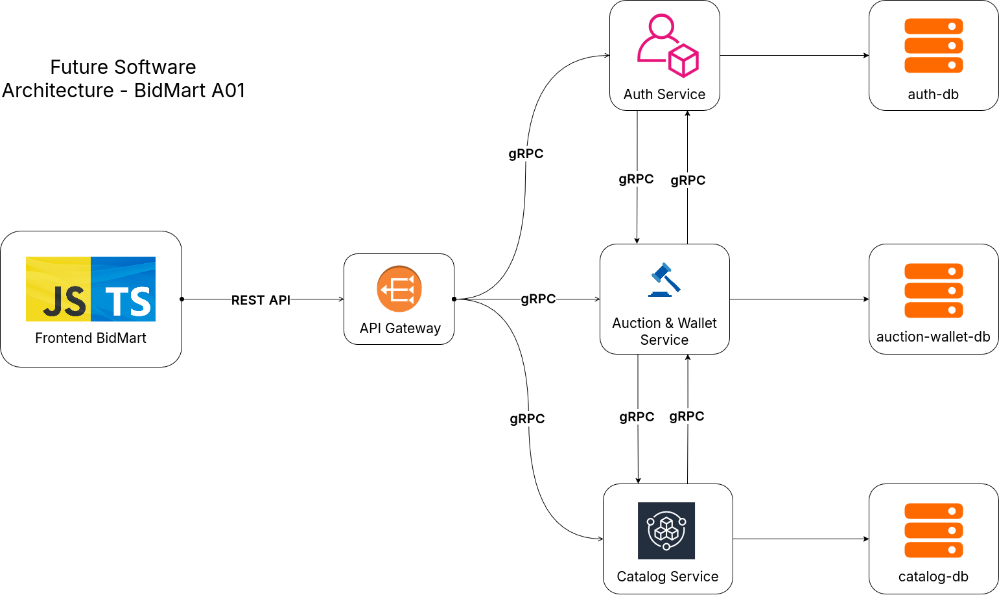
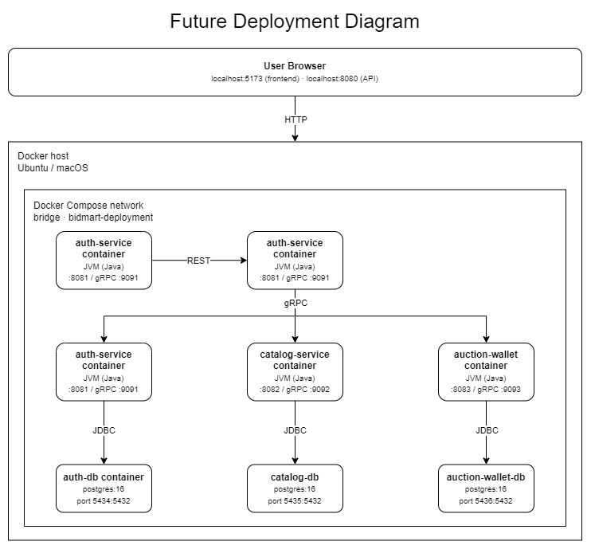
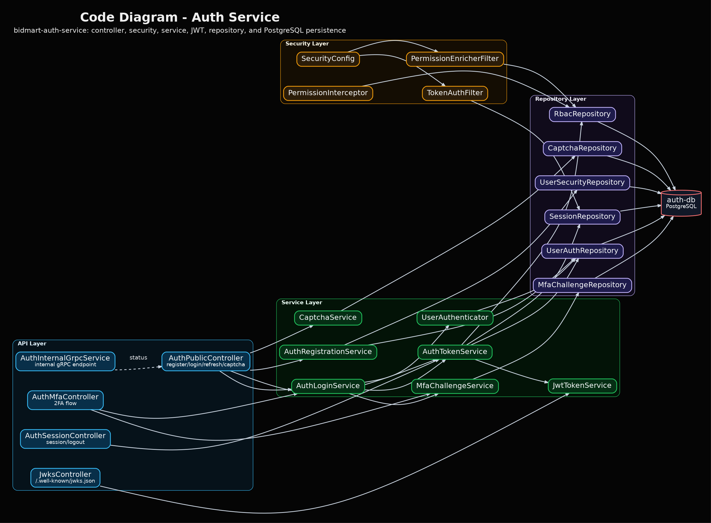
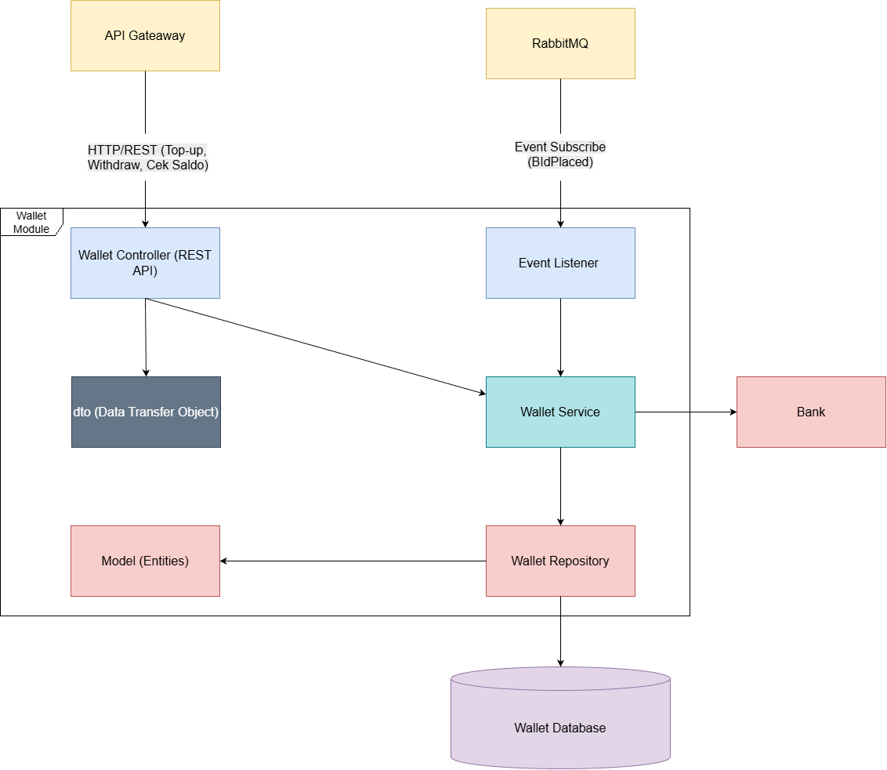

# Tutorial B: Visualizing and Architectural Risk - BidMart

Dokumentasi ini dibuat untuk memenuhi Tutorial B: **Visualizing and Architectural Risk** pada proyek BidMart A01. Repository `bidmart-deployment` digunakan sebagai pusat dokumentasi arsitektur karena repository ini berisi konfigurasi deployment dan integrasi service utama BidMart.

---

## Anggota Kelompok

**BidMart A01 - Advance Programming A**

| No. | Nama | NPM |
|---:|---|---|
| 1 | Neal Guarddin | 2406348282 |
| 2 | Go Nadine Audelia | 2406348774 |
| 3 | Renata Gracia | 2406399705 |
| 4 | Sahila Khairatul Athia | 2406495716 |

---

## Ringkasan Arsitektur

BidMart saat ini sudah memiliki core microservice deployment yang berfokus pada alur autentikasi:

```text
frontend-bidmart -> bidmart-api-gateway -> bidmart-auth-service -> auth-db
```

Arsitektur masa depan memperluas core stack tersebut dengan menambahkan service lain seperti Catalog Service, Auction-Wallet Service, database masing-masing service, asynchronous messaging, dan monitoring.

---

## Daftar Diagram

| Bagian | File |
|---|---|
| Current Context Diagram | `images/01-current-context.png` |
| Current Container Diagram | `images/02-current-container.png` |
| Current Deployment Diagram | `images/03-current-deployment.png` |
| Future Context Diagram | `images/04-future-context.png` |
| Future Container Diagram | `images/05-future-container.png` |
| Future Deployment Diagram | `images/06-future-deployment.png` |

---

# 1. Current Architecture

## 1.1 Current Context Diagram




Current context diagram menjelaskan posisi BidMart sebagai sistem yang digunakan oleh pengguna. Diagram ini menampilkan hubungan antara user, browser, dan sistem BidMart pada kondisi saat ini.

---

## 1.2 Current Container Diagram



Current container diagram menggambarkan **core deployment BidMart** yang saat ini menjadi fokus utama pada repository `bidmart-deployment`.

Pada tahap ini, sistem berfokus pada **core Auth flow** yang terdiri dari:

| Container | Tanggung Jawab |
|---|---|
| `frontend-bidmart` | Menyediakan user interface untuk pengguna |
| `bidmart-api-gateway` | Menjadi single public backend entry point |
| `bidmart-auth-service` | Menangani authentication, authorization, dan token/session logic |
| `auth-db` | Menyimpan data autentikasi |

### Alur Komunikasi Current Container

```text
User Browser
    -> frontend-bidmart
    -> bidmart-api-gateway
    -> bidmart-auth-service
    -> auth-db
```

### Penjelasan Current Container

- Frontend tidak memanggil Auth Service secara langsung.
- Semua request dari frontend diarahkan terlebih dahulu ke `bidmart-api-gateway`.
- API Gateway kemudian meneruskan request autentikasi ke `bidmart-auth-service` melalui komunikasi internal.
- Auth Service mengakses `auth-db` untuk kebutuhan data autentikasi.
- Dengan struktur ini, API Gateway berperan sebagai **single public backend entry point**.

### Batasan Current Architecture

Current architecture masih terbatas pada core Auth flow. Service berikut belum menjadi bagian utama dari deployment stabil saat ini:

- `bidmart-catalog-service`
- `bidmart-auction-wallet-service`
- RabbitMQ
- Prometheus
- Grafana

---

## 1.3 Current Deployment Diagram




Current architecture BidMart berjalan sebagai aplikasi monolith di atas Docker Compose pada satu host. Seluruh logika backend (Auth, Catalog, dan Auction & Wallet) terdapat dalam satu container Spring Boot yang terhubung ke satu database PostgreSQL. Frontend React dijalankan di container terpisah dengan Nginx sebagai web server. Komunikasi dari frontend ke backend dilakukan melalui HTTP REST, dan backend mengakses database melalui JDBC.

---

# 2. Future Architecture After Risk Storming

## 2.1 Future Context Diagram




Future context diagram menjelaskan posisi BidMart sebagai sistem microservice-based yang lebih lengkap setelah dilakukan risk storming.

---

## 2.2 Future Container Diagram



Future container diagram menggambarkan pengembangan BidMart menuju **microservice architecture** yang lebih lengkap.

Pada rancangan ini, `bidmart-api-gateway` tetap menjadi **single public backend entry point**, tetapi gateway tidak hanya meneruskan request ke Auth Service. Gateway juga meneruskan request ke service lain sesuai domain fitur.

### Alur Komunikasi Future Container


```text
User Browser
    -> frontend-bidmart
    -> bidmart-api-gateway
        -> bidmart-auth-service -> auth-db
        -> bidmart-catalog-service -> catalog-db
        -> bidmart-auction-wallet-service -> auction-wallet-db
```

### Service pada Future Architecture

| Service | Database | Tanggung Jawab |
|---|---|---|
| `bidmart-auth-service` | `auth-db` | Authentication, authorization, token/session logic |
| `bidmart-catalog-service` | `catalog-db` | Catalog, product listing, dan listing data |
| `bidmart-auction-wallet-service` | `auction-wallet-db` | Auction, bidding, wallet, dan settlement flow |

### Tujuan Pemisahan Service

Pemisahan service pada future architecture bertujuan untuk membuat BidMart lebih modular, scalable, dan maintainable. Pada arsitektur yang terlalu terpusat, pertambahan jumlah pengguna dan fitur dapat membuat sistem sulit dikembangkan karena semua bagian saling bergantung. Jika traffic meningkat, sistem juga menjadi sulit di-scale secara spesifik karena seluruh backend harus diperlakukan sebagai satu kesatuan.

Dengan memisahkan service berdasarkan domain, BidMart dapat memperoleh beberapa manfaat berikut:

- memperjelas ownership data pada setiap domain service;
- mengurangi coupling antar-domain seperti Auth, Catalog, dan Auction-Wallet;
- membuat setiap service lebih mudah dikembangkan secara mandiri;
- membuat testing lebih terisolasi;
- membuat deployment lebih fleksibel;
- memungkinkan service tertentu di-scale secara terpisah sesuai beban;
- mengurangi risiko bottleneck ketika jumlah pengguna bertambah;
- meningkatkan maintainability karena struktur sistem lebih modular;
- mengurangi risiko perubahan pada satu fitur memengaruhi seluruh sistem.

### Pengembangan Lanjutan

Future architecture juga membuka ruang untuk penambahan komponen pendukung seperti:

| Komponen | Fungsi |
|---|---|
| RabbitMQ | Mendukung asynchronous communication antar-service |
| Prometheus | Mengumpulkan metrics dari service |
| Grafana | Menampilkan monitoring dashboard |
| CI/CD Pipeline | Membantu deployment dan quality checking secara otomatis |

---

## 2.3 Future Deployment Diagram




Future architecture BidMart memisahkan backend menjadi beberapa service yang masing-masing berjalan dalam container tersendiri di atas Docker Compose. API Gateway menjadi satu-satunya entry point yang dapat diakses publik, meneruskan request ke service yang sesuai melalui gRPC. Setiap service memiliki database PostgreSQL-nya sendiri, sehingga tidak ada ketergantungan data antar service. Pemisahan ini membuat setiap service dapat dikembangkan, di-deploy, dan di-scale secara independen.

---

# 3. Risk Storming Explanation

Teknik Risk Storming diterapkan pada proyek BidMart sebagai metode kolaboratif untuk mengidentifikasi "hotspots" atau titik-titik kritis dalam arsitektur yang memiliki risiko kegagalan tinggi saat sistem sukses besar. Melalui proses ini, kami mensimulasikan berbagai skenario ekstrem, seperti lonjakan trafik pada detik-detik terakhir lelang (bid sniping) dan potensi kegagalan transaksi saldo. Identifikasi risiko ini sangat krusial bagi sistem yang bersifat time-sensitive seperti BidMart, di mana latensi milidetik dapat mempengaruhi integritas hasil lelang dan kepercayaan pengguna terhadap platform.

Salah satu hasil utama dari analisis Risk Storming adalah mitigasi terhadap risiko Distributed Transaction Failure. Kami menyimpulkan bahwa memisahkan layanan lelang dan dompet digital ke dalam dua microservice berbeda di fase ini memiliki risiko tinggi terhadap inkonsistensi data, di mana saldo pengguna mungkin terpotong namun penawaran gagal tercatat. Oleh karena itu, modifikasi arsitektur masa depan dilakukan dengan menggabungkan keduanya ke dalam `Auction-Wallet Service`. Dengan mengidentifikasi risiko ini lebih awal, kami dapat merancang sistem yang lebih tangguh dengan isolasi data yang tepat namun tetap menjaga keandalan pada operasi finansial yang kritis.

Secara keseluruhan, Risk Storming memberikan justifikasi teknis yang kuat bagi evolusi arsitektur kami. Teknik ini memastikan bahwa perubahan dari monolitik ke microservices bukan sekadar mengikuti tren, melainkan solusi nyata untuk memitigasi risiko skalabilitas dan keamanan data. Dengan pendekatan proaktif ini, BidMart dirancang untuk memiliki ketahanan (resilience) yang diperlukan untuk menghadapi ekspansi fitur di masa depan, seperti lelang aset perusahaan yang kompleks maupun lelang beasiswa berskala nasional.

### Hasil Risk Storming

| Risiko pada Current Architecture | Dampak | Modifikasi pada Future Architecture |
|---|---|---|
| Single Database Bottleneck | Lonjakan trafik lelang dapat mengganggu performa modul lain (Auth/Katalog) karena berbagi database yang sama. | Implementasi Database per Service untuk mengisolasi beban kerja tiap modul. |
| Distributed Transaction Inconsistency | Jika Auction dan Wallet terpisah, kegagalan jaringan saat bid dapat mengakibatkan saldo terpotong tapi bid tidak tercatat. | Menggabungkan modul Auction dan Wallet ke dalam satu Auction-Wallet Service untuk menjaga atomisitas transaksi. |
| High Latency pada Update Harga | Pengguna melihat harga yang tidak akurat (stale data) saat persaingan ketat di menit-menit akhir. | Penggunaan Redis Caching dan Message Broker (RabbitMQ) untuk pembaruan harga secara real-time dan asinkron. |
| Cascading Failure | Kesalahan pada modul pendukung dapat melumpuhkan seluruh sistem lelang yang sedang berjalan. | Penerapan Microservice Architecture dengan API Gateway sehingga kegagalan satu service tidak mematikan service lainnya. |

# 4. Individual Work

Bagian individual menjelaskan component diagram dan code diagram dari kontribusi masing-masing anggota. Setiap anggota dapat menambahkan diagram individual sesuai scope pekerjaannya masing-masing.

Individual work tetap dikaitkan dengan group container diagram. Artinya, setiap diagram individual harus menjelaskan bagian tertentu dari container architecture BidMart, bukan menggambar ulang seluruh sistem.

Format umum individual work:

- satu individual component diagram;
- satu atau lebih code diagram;
- penjelasan korelasi dengan group container diagram;
- link commit individual.

---

## 4.1 Neal Guarddin

### Fokus Kontribusi

Bagian individual Neal berfokus pada core authentication flow dan deployment integration yang sudah menjadi bagian dari current architecture BidMart.

| Area | Repository | Kontribusi |
|---|---|---|
| Frontend | `frontend-bidmart` | Alur autentikasi dari UI menuju API Gateway |
| API Gateway | `bidmart-api-gateway` | Public entry point, routing, security boundary, dan komunikasi internal ke Auth Service |
| Auth Service | `bidmart-auth-service` | Login, register, token/session handling, JWT/JWKS, gRPC endpoint, dan akses ke Auth DB |
| Deployment | `bidmart-deployment` | Docker Compose, environment configuration, smoke test, dan dokumentasi arsitektur |

### Korelasi dengan Group Container Diagram

Pada group container diagram, core flow yang berhubungan langsung dengan kontribusi Neal adalah:

```text
frontend-bidmart -> bidmart-api-gateway -> bidmart-auth-service -> auth-db
```

Individual component diagram dan code diagrams memperluas flow tersebut dengan menunjukkan detail internal dari frontend authentication flow, API Gateway routing/security, Auth Service, dan deployment configuration.

### Individual Component Diagram


Diagram ini menunjukkan hubungan antara komponen frontend, API Gateway, Auth Service, dan `auth-db`. Diagram ini merupakan perluasan dari group container diagram pada bagian authentication flow.

### Code Diagram: Frontend Auth Flow


Diagram ini menunjukkan bagaimana frontend mengelola login/register, auth state, token storage, dan komunikasi API menuju API Gateway.

### Code Diagram: API Gateway


Diagram ini menunjukkan struktur API Gateway sebagai single public backend entry point. Gateway bertanggung jawab untuk routing, security validation, user context forwarding, dan komunikasi internal ke Auth Service.

### Code Diagram: Auth Service



Diagram ini menunjukkan struktur internal Auth Service, termasuk controller, security layer, service layer, repository layer, JWT/JWKS, MFA, session handling, dan akses ke `auth-db`.

### Code Diagram: Deployment Configuration


Diagram ini menunjukkan bagaimana deployment repository menghubungkan `frontend-bidmart`, `bidmart-api-gateway`, `bidmart-auth-service`, dan `auth-db` dalam Docker Compose environment.

### Link Individual Work

| Item | Link |
|---|---|
| Individual repository | `https://github.com/advprog-2026-A01-project/bidmart-auth-service` |
| Individual commit | `TODO: masukkan link commit individual Neal` |

---

## 4.2 Go Nadine Audelia

> TODO: Tambahkan individual component diagram, code diagram, dan link commit individual.

### Fokus Kontribusi

| Area | Repository | Kontribusi |
|---|---|---|
| TODO | TODO | TODO |

### Individual Component Diagram



### Code Diagram


### Link Individual Work

| Item | Link |
|---|---|
| Individual repository | `TODO` |
| Individual commit | `TODO` |

---

## 4.3 Renata Gracia

> TODO: Tambahkan individual component diagram, code diagram, dan link commit individual.

### Fokus Kontribusi

| Area | Repository | Kontribusi |
|---|---|---|
| TODO | TODO | TODO |

### Individual Component Diagram


### Code Diagram


### Link Individual Work

| Item | Link |
|---|---|
| Individual repository | `TODO` |
| Individual commit | `TODO` |

---

## 4.4 Sahila Khairatul Athia

> TODO: Tambahkan individual component diagram, code diagram, dan link commit individual.

### Fokus Kontribusi

| Area | Repository | Kontribusi |
|---|---|---|
| TODO | TODO | TODO |

### Individual Component Diagram


### Code Diagram


### Link Individual Work

| Item | Link |
|---|---|
| Individual repository | `TODO` |
| Individual commit | `TODO` |

---

# 5. Container Diagram Summary

| Aspek | Current Container Architecture | Future Container Architecture |
|---|---|---|
| Fokus utama | Core Auth flow | Full microservice architecture |
| Entry point backend | API Gateway | API Gateway |
| Service utama | Auth Service | Auth Service, Catalog Service, Auction-Wallet Service |
| Database | `auth-db` | `auth-db`, `catalog-db`, `auction-wallet-db` |
| Komunikasi frontend | Frontend ke API Gateway | Frontend ke API Gateway |
| Komunikasi backend | Gateway ke Auth Service | Gateway ke service sesuai domain |
| Data ownership | Masih terbatas pada Auth domain | Dipisahkan berdasarkan domain service |
| Coupling | Lebih sederhana tetapi masih terbatas | Lebih rendah karena service dan database dipisah |
| Scalability | Masih terbatas pada core Auth flow | Service dapat dikembangkan dan di-scale secara lebih spesifik |
| Maintainability | Masih sederhana, tetapi akan sulit jika semua fitur bertambah dalam satu flow | Lebih maintainable karena tanggung jawab dipisahkan berdasarkan domain |
| Pengembangan berikutnya | Integrasi service tambahan | Event bus, monitoring, dan deployment yang lebih lengkap |

---

# 6. Kesimpulan

Current architecture menunjukkan bahwa BidMart sudah mulai dipisahkan dari monolith melalui core Auth flow:

```text
frontend-bidmart -> bidmart-api-gateway -> bidmart-auth-service -> auth-db
```

Future architecture memperluas struktur tersebut menjadi microservice architecture yang lebih lengkap:

```text
frontend-bidmart -> bidmart-api-gateway -> Auth / Catalog / Auction-Wallet services
```

Dengan perubahan ini, BidMart memiliki struktur yang lebih modular, lebih mudah dikembangkan, dan lebih siap untuk integrasi service tambahan pada tahap berikutnya. Pemisahan service juga membantu sistem menjadi lebih scalable ketika jumlah pengguna meningkat, karena service tertentu dapat dikembangkan dan di-scale sesuai kebutuhan bebannya.

---

# 7. Submission Evidence

Bagian ini digunakan untuk mencatat link commit yang akan dikumpulkan pada submission form.

## Group Work Commits

| Bagian | Commit Message | Link Commit |
|---|---|---|
| Commit 1 | `1. The current architecture of the group, the context, container and deployment diagram` | https://github.com/advprog-2026-A01-project/bidmart-deployment/tree/tutorial-b-architecture-risk/docs/architecture |
| Commit 2 | `2. The future architecture of the group after risk storming` | https://github.com/advprog-2026-A01-project/bidmart-deployment/tree/tutorial-b-architecture-risk/docs/architecture |
| Commit 3 | `3. Explanation of risk storming of the group` | https://github.com/advprog-2026-A01-project/bidmart-deployment/tree/tutorial-b-architecture-risk/docs/architecture |

## Individual Work Commits

| Nama | Repository             | Link Commit |
|---|------------------------|---|
| Neal Guarddin | `bidmart-auth-service` | https://github.com/advprog-2026-A01-project/bidmart-auth-service |
| Neal Guarddin | `bidmart-deployment`   | https://github.com/advprog-2026-A01-project/bidmart-deployment |
| Neal Guarddin | `frontend-bidmart`     | https://github.com/advprog-2026-A01-project/frontend-bidmart |
| Neal Guarddin | `bidmart-api-gateway`  | https://github.com/advprog-2026-A01-project/bidmart-api-gateway |
| Go Nadine Audelia | TODO                   | TODO |
| Renata Gracia | TODO                   | TODO |
| Sahila Khairatul Athia | TODO                   | TODO |

---

# 8. Submission Notes

Project repository yang digunakan untuk group architecture documentation:

```text
https://github.com/advprog-2026-A01-project/bidmart-deployment
```

Repository individual work dapat berbeda sesuai scope masing-masing anggota. Untuk Neal, individual work dikerjakan pada:

```text
https://github.com/advprog-2026-A01-project/bidmart-auth-service
```

Pada submission form, link commit group work digunakan untuk Commit 1, Commit 2, dan Commit 3. Link commit individual work digunakan untuk Commit 4.